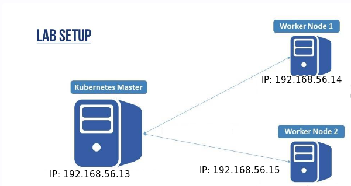

# k8s-cluster
<h1>
  
</h1>
CREATE CLUSTER K8S WITH ONE MASTER AND 2 WORKER

* 192.168.56.13 master
* 192.168.56.14 worker-1
* 192.168.56.15 worker-2

REFERENCIA [here](https://baykara.medium.com/setup-own-kubernetes-cluster-via-virtualbox-99a82605bfcc)

Necessaŕio ter instalado
-----------------------------------------------------------
vagrant [here](https://computingforgeeks.com/using-vagrant-with-virtualbox-kvm-on-rocky/)
-------------------------------------------------------------------------------------------
virtualbox
-------------------------------------------------------------

before cloning the repo use the comando
--------------------------------------------------------------------------------------------------
acess the past 
cd /vagrant 

vagrant up

para acessar as maquinas com user vagrant 
----------------------------------------------------------------------------------------------
vagrant ssh master
vagrant ssh worker-1
vagrant ssh worker-2

-------------------------------------
acessar via chave pois copiamos nossa chave para dentro das vms
----------------------------------------
ssh -i ansible/k8s-key vagrant@192.168.56.13
-------------------------------------------
ssh -i ansible/k8s-key vagrant@192.168.56.14
--------------------------------------------
ssh -i ansible/k8s-key vagrant@192.168.56.15

caso de algum erro semelhante rodar os seguintes comandos
------------------------------------------------------------------------
@@@@@@@@@@@@@@@@@@@@@@@@@@@@@@@@@@@@@@@@@@@@@@@@@@@@@@@@@@@
@    WARNING: REMOTE HOST IDENTIFICATION HAS CHANGED!     @
@@@@@@@@@@@@@@@@@@@@@@@@@@@@@@@@@@@@@@@@@@@@@@@@@@@@@@@@@@@
IT IS POSSIBLE THAT SOMEONE IS DOING SOMETHING NASTY!
Someone could be eavesdropping on you right now (man-in-the-middle attack)!
It is also possible that a host key has just been changed.
The fingerprint for the ECDSA key sent by the remote host is
SHA256:ehwdqE0dcBPHX2YP5xgYMMIhFCkkSVWfI54E1ue8P/Y.
Please contact your system administrator.
---------------------------------------------------------------------------------


ssh-keygen -R 192.168.56.   mudar somente o ip final 
 esse comando atualiza o know hosts da sua maquina

```
testando com ansible 

ansible -i hosts all -m ping -u vagrant 


-----------------------------------------------
  __________ 
 |          |
 | ANSIBLE  |
 |__________|
 
-------------------------------------------------

ATENÇÃO para o caminho e nome da chave 

##Criando usuario kube e trocando chaves.... com o seguinte comando 
-----------------------------------------------------------------------------------------
ansible-playbook -i hosts users.yml -u vagrant

Pronto agora temos nosso usuario kube criado em todas as maquinas 

##Agora instalar containerD desabilita swap instala kubeadm kubelet e mais ... em todas as máquinas
---------------------------------------------------------------------------------------------
ansible-playbook -i hosts playbook/install-k8s.yml -u kube

##Criando cluster master e pod network 
-----------------------------------------------------------------------------------------------
ansible-playbook -i hosts playbook/master.yml -u kube

##Adicionando Workers no master
----------------------------------------------------------------------------------------------
ansible-playbook -i hosts playbook/join-workers.yml -u kube